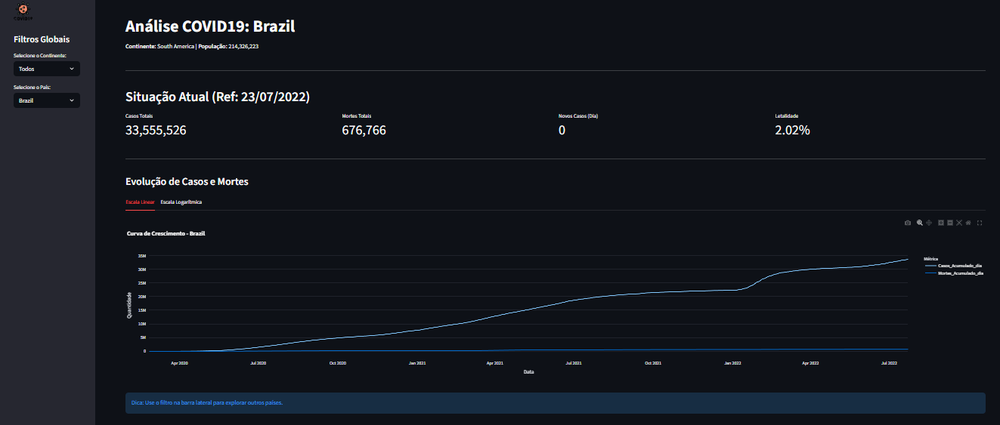
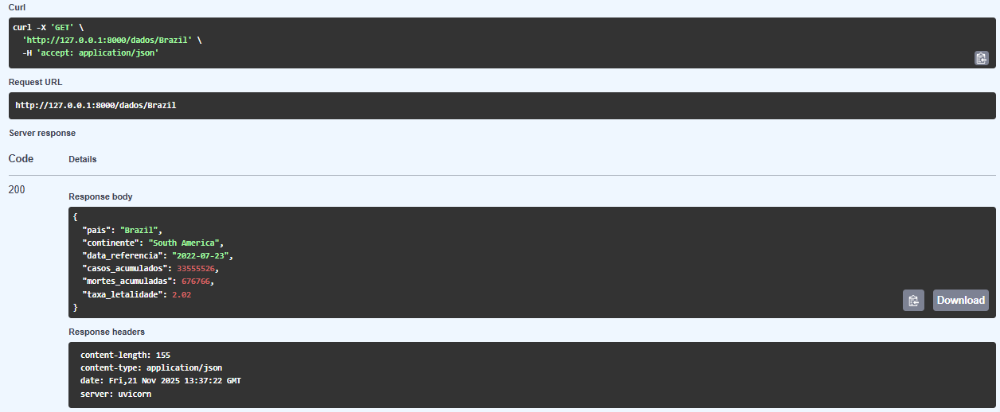

[](https://www.linkedin.com/in/allan-thomas-352b75181/) [](https://www.python.org/) []() []()

---

# 📊 COVID-19 Analytics Pipeline: Dados de Ponta a Ponta
*(Da Ingestão Bruta à Tomada de Decisão com API e Dashboard)*

Bem-vindo ao repositório oficial do projeto!  
Aqui demonstro um ciclo completo de **Engenharia e Análise de Dados**, simulando um ambiente de produção real.

- 🚀 **ETL Robusto:** Pipeline de tratamento de dados com **Pandas** e **OpenPyxl**.
- 🧠 **Backend Profissional:** API REST documentada com **FastAPI** e **Swagger UI**.
- 🤖 **Frontend Interativo:** Dashboard analítico construído em **Streamlit** e **Plotly**.
- ✅ **Qualidade:** Testes de integração automatizados com **Pytest**.

> **Observação:** O projeto utiliza dados públicos e tem caráter de portfólio técnico para demonstração de competências Full Stack Data.

---

## 🌟 Componentes do Projeto

| 🏷️ Módulo | 💻 Tecnologias | 📝 O que faz? |
| :--- | :--- | :--- |
| **Ingestão & ETL** | Python, Pandas | Lê planilhas Excel (`raw`), trata nulos, padroniza nomes e cruza bases (Casos + População) gerando um CSV otimizado. |
| **API (Backend)** | FastAPI, Uvicorn | Disponibiliza os dados tratados via endpoints JSON para consumo externo. Inclui doc interativa (`/docs`). |
| **Dashboard** | Streamlit, Plotly | Interface visual para exploração de dados, com filtros de continente/país e gráficos de tendência e letalidade. |
| **Testes** | Pytest, HTTPX | Garante que a API não quebre com atualizações, testando rotas e retornos de erro (404/500). |

---

## 🏗 Arquitetura e Estrutura

O fluxo segue uma arquitetura modular dividida em camadas de **Ingestion**, **Storage** e **Consumption**.

```text
covid-analytics/
├── data/
│   ├── raw/             # Arquivos originais (.xlsx)
│   └── processed/       # Dados limpos e tratados (.csv)
├── src/
│   ├── etl.py           # Script de Extração, Transformação e Carga
│   └── api.py           # Aplicação FastAPI (Backend)
├── dashboard/
│   └── app.py           # Aplicação Streamlit (Frontend)
├── tests/               # Testes automatizados
├── requirements.txt     # Dependências do projeto
└── README.md            # Documentação
```
## 🚀 Como Rodar o Projeto

### 1. Preparação do Ambiente

```Bash
# Clone o repositório
git clone [https://github.com/AThomasA/covid19-analytics-pipeline.git](https://github.com/AThomasA/covid19-analytics-pipeline.git)
cd covid19-analytics-pipeline

# Crie e ative o ambiente virtual
python -m venv .venv
source .venv/bin/activate  # Windows: .venv\Scripts\activate

# Instale as dependências
pip install -r requirements.txt
```
## 2. Execução do Pipeline (ETL)

### Obrigatório rodar na primeira vez para gerar a base de dados:
```Bash
python src/etl.py
# ✅ Output esperado: "ETL Concluído! Arquivo gerado em data/processed/..."
```

## 3. Subindo as Aplicações

### Recomendo abrir dois terminais para rodar simultaneamente:

| App | Aplicação	| Comando	| Acesso |
| Dashboard	| streamlit | run dashboard/app.py	| http://localhost:8501 |
| API	| uvicorn | src.api:app --reload	| http://127.0.0.1:8000/docs |

## 4. Validando com Testes
```Bash
python -m pytest
```
## 📊 Demonstração Visual
### 📈 Dashboard Interativo
Visualização de tendências temporais e KPIs globais.


### 🔌 API (Swagger UI)
Documentação automática e testável dos endpoints.


### 🛠 Tecnologias Utilizadas
- Linguagem: Python 3.11
- Manipulação de Dados: Pandas, OpenPyxl
- Web Frameworks: FastAPI (Backend), Streamlit (Frontend)
- Visualização: Plotly Express
- Testes: Pytest, HTTPX

## 👤 Sobre o Autor
### Allan Thomas

"Transformando dados complexos em soluções visuais e APIs robustas. Focado em Data Science, Engenharia de Dados e Python."

---

<div align="center"> Desenvolvido por <strong>Allan Thomas</strong> 🚀


<a href="https://www.linkedin.com/in/allan-thomas-352b75181/" target="_blank">  </a> </div>